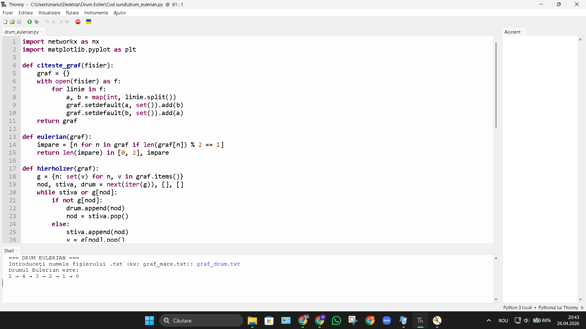
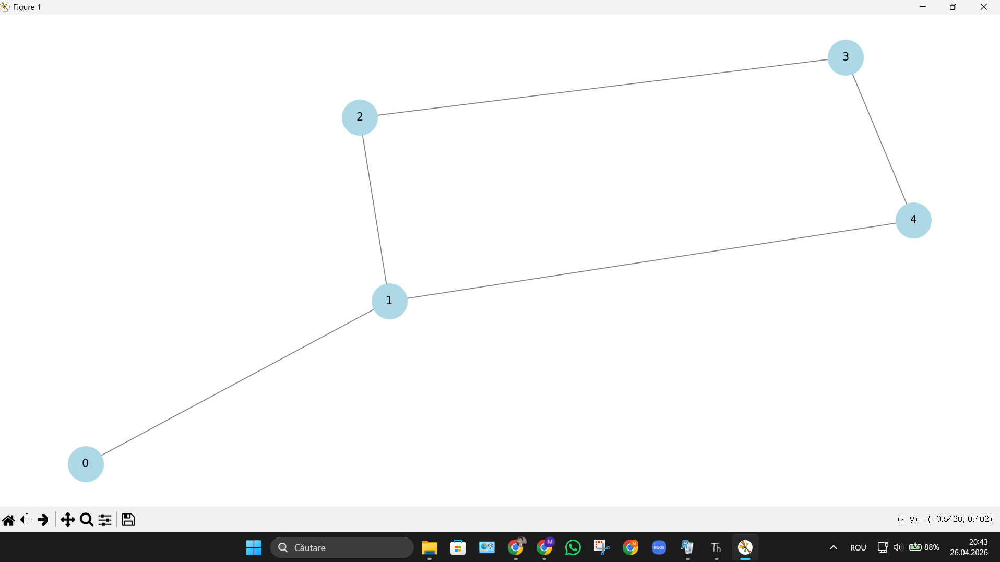

# 🔍 Eulerian Path Finder

## 📌 Overview

This project implements an algorithm for detecting and constructing an **Eulerian path** in an undirected graph.

An Eulerian path is a path that visits every edge exactly once. Such a path exists only if the graph contains **0 or 2 nodes with odd degree**.

The application:

* reads graph data from a file
* checks if an Eulerian path exists
* computes the path using an efficient algorithm
* visualizes the graph

---

## ⚙️ Features

* ✔️ Graph input from `.txt` file (edge list)
* ✔️ Eulerian path validation
* ✔️ Detection of odd-degree nodes
* ✔️ Path computation using Hierholzer’s algorithm
* ✔️ Graph visualization (NetworkX + Matplotlib)
* ✔️ Clean and readable Python code

---

## 🧠 Algorithm

The project uses **Hierholzer’s Algorithm**:

* Time Complexity: **O(E)**
* Works for:

  * 0 odd-degree nodes → Eulerian circuit
  * 2 odd-degree nodes → Eulerian path

---

## 📂 Project Structure

```
eulerian-path-finder/
│
├── src/
│   └── drum_eulerian.py
│
├── data/
│   ├── graf_drum.txt
│   ├── graf_mare.txt
│   ├── graf_mic.txt
│
├── screenshots/
│   ├── program_output.png
│   ├── graph_visual.png
│
└── README.md
```

---

## 🚀 How to Run

### 1. Install dependencies

```bash
pip install networkx matplotlib
```

### 2. Run the program

```bash
python src/drum_eulerian.py
```

### 3. Provide input

```
Enter graph file: data/graf_drum.txt
```

---

## 🧪 Example Input

```
0 1
1 2
2 3
3 4
4 1
```

---

## 📊 Output Example

```
=== EULERIAN PATH FINDER ===
Eulerian path:
1 → 4 → 3 → 2 → 1 → 0
```

---

## 📸 Screenshots

### Program Output



### Graph Visualization



---

## 🛠️ Technologies Used

* Python 3
* NetworkX
* Matplotlib

---

## 📈 Future Improvements

* Support for directed graphs
* Export results (JSON / CSV)
* CLI arguments instead of manual input
* Optimization for large graphs

---

## 👤 Author

**Marius Andronic**
Computer Dual Engineering Student

---

## 📄 License

MIT License
